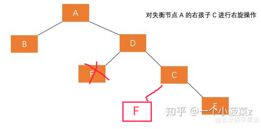

线性表，右为头左为尾，上为顶下为底。

## 栈
栈（stack）是限定仅在表尾进行插入或删除的线性表。其中添加/移除新项总发生在同一端。

这一端通常称为“栈顶”(top，表尾端)。与栈顶对应的端称为“栈底”（bottom，表头端）。 

栈的底部很重要，因为在栈中靠近底部的项是存储时间最长的。最近添加的项是最先移除的。 

这种排序原则有时被称为** LIFO( Last In First Out，即后进先出)**。 

可以把栈理解为在桌子上，把书一本本叠起来。拿起一本书放在书堆的最上面，当然也只有先拿走上面的书才能拿走下面的书。

### 栈的基本操作
- Stack() 创建一个空的新栈。 它不需要参数，并返回一个空栈。
- push(item)：在栈的最上方插入元素
- pop()：返回栈最上方的元素，并将其删除
- isEmpty()：查询栈是否为空
- top()，或者称为 peek()：返回栈最上方的元素，并不删除
- size()，返回 item 数量。
### [栈的具体实现](stack/stack.py)

## 队列
队列（queue）是一种先进先出的（FIFO，First In First Out）线性表。只允许在表的一端插入而在另一端删除。
其中允许插入的一端称为队尾(rear)，允许删除的一端称为队头（front）。
当一个元素从队尾进入队列时，一直向队头移动，直到它成为下一个需要移除的元素为止。
### 队列的基本操作
- Queue() 创建一个空的新队列。 它不需要参数，并返回一个空队列。
- enqueue(item) 将新项添加到队尾。 它需要 item 作为参数，并不返回任何内容。
- dequeue() 从队头移除项。它不需要参数并返回 item。 队列被修改。
- isEmpty() 查看队列是否为空。它不需要参数，并返回布尔值。
- size() 返回队列中的项数。它不需要参数，并返回一个整数。

[队列的具体实现](queue/queue.py)

### 双端队列
双端队列（deque）是限定插入和删除操作在表的两端的线性表。它的两个端点（首部和尾部）都可以进行添加和删除操作。  
在某种意义上，这种混合线性结构提供了单个数据结构中的栈和队列的所有能力。但在实际应用中远不及栈和队列有用。

### 双端队列的基本操作
- Deque() 创建一个空的新 deque。它不需要参数，并返回空的 deque。
- addFront(item) 将一个新项添加到 deque 的首部。它需要 item 参数 并不返回任何内容。
- addRear(item) 将一个新项添加到 deque 的尾部。它需要 item 参数并不返回任何内容。
- removeFront() 从 deque 中删除首项。它不需要参数并返回 item。deque 被修改。
- removeRear() 从 deque 中删除尾项。它不需要参数并返回 item。deque 被修改。
- isEmpty() 测试 deque 是否为空。它不需要参数，并返回布尔值。
- size() 返回 deque 中的项数。它不需要参数，并返回一个整数。

[双端队列的具体实现](queue/deque.py)

[循环队列](https://www.cnblogs.com/curo0119/p/8608606.html)

在用数组实现队列的时候，当有元素出列，头指针front就向后移动，此时队列前面的空间就空了出来。每当添加元素，尾指针rear+1，当尾指针rear移动到LENGTH时（数组的最大下标处的地址），再入队会发生假溢出。也就是说实际上我们开辟的数组还有剩余空间，却因为rear越界表现为溢出。  

为了更合理的利用空间，将队列的首尾相连接。这样当rear移动到LENGTH时，会再从0开始循环。

那当什么时候队列满呢？当rear等于front的时候，无法判断队列为空还是满。有两个方法：  

办法一是设置一个标志变量flag，当front == rear,且flag = 0时为队列空，当front == rear,且flag= 1时为队列满。  

办法二牺牲一个存储空间，front前面不存数据，当rear在front前面的时候就是满了。

#### 循环队列的基本操作
- LoopQueue(size) 创建一个空的新队列，size用于指定循环队列的大小，不输入参数size使用默认值。
- enqueue(item) 将新项添加到队尾。 它需要 item 作为参数，并不返回任何内容。
- dequeue() 从队头移除项。它不需要参数并返回 item。 队列被修改。
- isEmpty() 查看队列是否为空。它不需要参数，并返回布尔值。
- size() 或者 \_\_len\_\_() 返回队列中的项数。它不需要参数，并返回一个整数。
#### 队空与队满
队空条件为：`front==rear`
队满条件为：`(rear+1)%QueueSize==front`

##### [循环队列的实现](queue/loopqueue.py)

## 链表
### 单链表
- ist() 创建一个新的空单链表，无返回值。
- add(item) 在链表头部插入元素，需要item作为参数，无返回值。
- append(item) 在链表尾部添加元素，需要item作为参数，无返回值。
- insert(pos, item) 在指定位置 pos 插入元素 item。无返回值。
- remove(item) 删除节点值等于 item 的节点。一般无返回值。若没有该值，返回 -1，表示出错。
- search(item) 查找节点是否存在，返回布尔值。空列表返回False。
- isEmpty() 链表是否为空，返回布尔值
- size() 或者 \_\_len\_\_()，返回链表元素个数。
- traverse() 遍历整个链表，无返回值。

[单链表的实现](list/lists.py)

### 循环链表
循环链表(circular linked list)是另一种形式的链式存储结构，它与单链表不同在于表中最后一个指针域指向头节点。整个链表形成一个环。

### 双向链表
单向链表只能顺指针往后寻找其他节点。若要寻查节点的直接前趋，则需要从表头指针出发。

为克服单链表的这种单向性的缺点，可利用双向链表（double linked list）。  

双向链表的节点中有两个指针域，其一指向直接后继，另一指向直接前趋。

## [树](https://blog.csdn.net/g360z247j123/article/details/51858563)
树的递归定义如下:

一棵树是一些节点的集合。这个集合可以为空集或非空集；

若树非空，则它由称为根(root)的节点r以及0个或多个非空的(子)树T1，T2，…Tk组成，

这些子树中每一棵树都被来自根r的一条有向的边(edge)所连接。 

### 二叉树

二叉树（Binary Tree）是另一种树形结构，它的特点是每个结点至多只有两颗子树（即二叉树中不存在度大于二的节点）。
并且，二叉树的子树有左右之分，其次序不能任意颠倒。

[二叉树的实现](tree/BinaryTree.py)

[常见的二叉树](https://www.cnblogs.com/jiahongwu/p/bTree.html)

[二叉树的分类](https://www.cnblogs.com/sunshineliulu/p/7775063.html)

- 二叉搜索树（Binary Search Tree，BST）
- 平衡二叉树（AVL）[什么是平衡二叉树（AVL）](https://zhuanlan.zhihu.com/p/56066942)

- 红黑树（Red Black Tree）

### 二叉搜索树（Binary Search Tree，BST）

或者是一棵空树，或者是具有下列性质的二叉树：

1. 若它的左子树不空，则左子树上所有结点的值均小于它的根结点的值；
2. 若它的右子树不空，则右子树上所有结点的值均大于它的根结点的值；
3. 它的左、右子树也分别为二叉排序树。

中序遍历二叉排序树可得到一个依据关键字的有序序列，一个无序序列可以通过构造一棵二叉排序树变成一个有序序列，构造树的过程即是对无序序列进行排序的过程。每次插入的新的结点都是二叉排序树上新的叶子结点，在进行插入操作时，不必移动其它结点，只需改动某个结点的指针，由空变为非空即可。搜索、插入、删除的时间复杂度等于树高，期望O(logn)，最坏O(n)（数列有序，树退化成线性表，如右斜树）

#### 查找

查找过程：

1.若b是空树，则搜索失败，否则：

2.若x等于b的根节点的数据域之值，则查找成功；否则：

3.若x小于b的根节点的数据域之值，则搜索左子树；否则：

4.查找右子树。

5.若查找不成功， 则指针 p 指向查找路径上访问的最后一个结点并返回FALSE

#### 插入

插入的位置必定是叶子节点

1. 先调用**查找操作**将要插入的关键字进行比较
2. 如果在原有的二叉排序树中没有要插入的关键字，则将关键字与查找的结点p（在查找操作中返回的结点）的值进行比较
3. **若p为空，则插入关键字赋值给该节点；**
4. **若小于结点p的值，则插入关键字作为结点p的左子树；**
5. **若大于结点p的值，则插入关键字作为结点p的右子树；**

每次需要插入的节点都为叶子节点。

### [平衡二叉树（AVL）](https://zhuanlan.zhihu.com/p/56066942)

#### 为什么要有平衡二叉树

二叉搜索树一定程度上可以提高搜索效率，但是当原序列有序时，例如序列 A = {1，2，3，4，5，6}，构造二叉搜索树如下。依据此序列构造的二叉搜索树为右斜树，同时二叉树退化成单链表，搜索效率降低为 O(n)。

如果构造为二叉平衡树，则如下图

#### 定义

**平衡二叉查找树**：简称平衡二叉树。由前苏联的数学家 **A**delse-**V**elskil 和 **L**andis 在 1962 年提出的高度平衡的二叉树，根据科学家的英文名也称为 AVL 树。它具有如下几个性质：

1. 可以是空树。
2. 假如不是空树，任何一个结点的左子树与右子树都是平衡二叉树，并且高度之差的绝对值不超过 1。

#### 平衡因子

某节点的左子树与右子树的高度(深度)差即为该节点的平衡因子（BF,Balance Factor），平衡二叉树中不存在平衡因子大于 1 的节点。在一棵平衡二叉树中，节点的平衡因子只能取 0 、1 或者 -1  ，分别对应着左右子树等高，左子树比较高，右子树比较高。

#### 最小失衡树

上图所示的节点，当插入99后，节点 66 的左子树高度为 1，右子树高度为 3，此时平衡因子为 -2，树失去平衡。

**平衡二叉树的失衡调整主要是通过旋转最小失衡子树来实现的**。根据旋转的方向有两种处理方式，**左旋** 与 **右旋** 。

旋转的目的就是减少高度，通过降低整棵树的高度来平衡。哪边的树高，就把那边的树向上旋转。

#### 左旋

加入新节点 99 后， 节点 66 的左子树高度为 1，右子树高度为 3，此时平衡因子为 -2。为保证树的平衡，此时需要对节点 66 做出旋转，因为右子树高度高于左子树，对节点进行左旋操作，流程如下：

1. 节点的右孩子替代此节点位置 
2. 右孩子的左子树变为该节点的右子树 
3. 节点本身变为右孩子的左子树

#### 右旋

***【注】这个图的节点75应该是65，画错了。***

1. 节点的左孩子代表此节点
2. 节点的左孩子的右子树变为节点的左子树
3. 将此节点作为左孩子节点的右子树

【总结】旋转哪边就降低哪边高度

#### 插入

##### 左孩子的左子树插入节点（LL）

只需要执行一次左旋

##### 右孩子的右子树插入节点（RR）

只需要执行一次右旋

##### 左孩子的右子树插入节点（LR）

1. 先对该节点的左孩子左旋（即LL）
2. 左旋后，再对该节点右旋（即RR）

总之，过程是先左旋再右旋，LR。

如图，若 A 的左孩子节点 B 的右子树 E 插入节点 F ，导致节点 A 失衡

先左旋再右旋，过程为：

##### 右孩子的左子树插入节点（RL）

1. 先对该节点的右孩子右旋（即RR）
2. 右旋后，再对该节点左旋（即LL）

总之，过程是先右旋再左旋，RL。

如图，若 A 的右孩子节点 C 的右子树 D 插入节点 F ，导致节点 A 失衡

先右旋再左旋，过程为：

#####  总结

1. 在所有的不平衡情况中，都是按照先 **寻找最小不平衡树**，然后 **寻找所属的不平衡类别**，再 **根据 4 种类别进行固定化程序的操作**。
2. LL , LR ，RR ，RL其实已经为我们提供了最后哪个结点作为新的根指明了方向。如 LR 型最后的根结点为原来的根的左孩子的右孩子，RL 型最后的根结点为原来的根的右孩子的左孩子。只要记住这四种情况，可以很快地推导出所有的情况。
3. 维护平衡二叉树，最麻烦的地方在于平衡因子的维护。

#### 删除

暂略

code [C++ 平衡二叉树AVL](https://blog.csdn.net/nightwizard2030/article/details/72874715)

### 红黑树（Red Black Tree）

红黑树是每个节点都带有颜色属性的二叉查找树，颜色或红色或黑色。在二叉查找树强制一般要求以外，对于任何有效的红黑树我们增加了如下的额外要求:

性质1. 节点是红色或黑色。

性质2. 根节点是黑色。

性质3 每个红色节点的两个子节点都是黑色。(从每个叶子到根的所有路径上不能有两个连续的红色节点)

性质4. 从任一节点到其每个叶子的所有路径都包含相同数目的黑色节点。

这些约束强制了红黑树的关键性质:  从根到叶子的最长的可能路径不多于最短的可能路径的两倍长。结果是这个树大致上是平衡的。因为操作比如插入、删除和查找某个值的最坏情况时间都要求与树的高度成比例，这个在高度上的理论上限允许红黑树在最坏情况下都是高效的，而不同于普通的二叉查找树。

要知道为什么这些特性确保了这个结果，注意到性质3导致了路径不能有两个毗连的红色节点就足够了。最短的可能路径都是黑色节点，最长的可能路径有交替的红色和黑色节点。因为根据性质4所有最长的路径都有相同数目的黑色节点，这就表明了没有路径能多于任何其他路径的两倍长。

